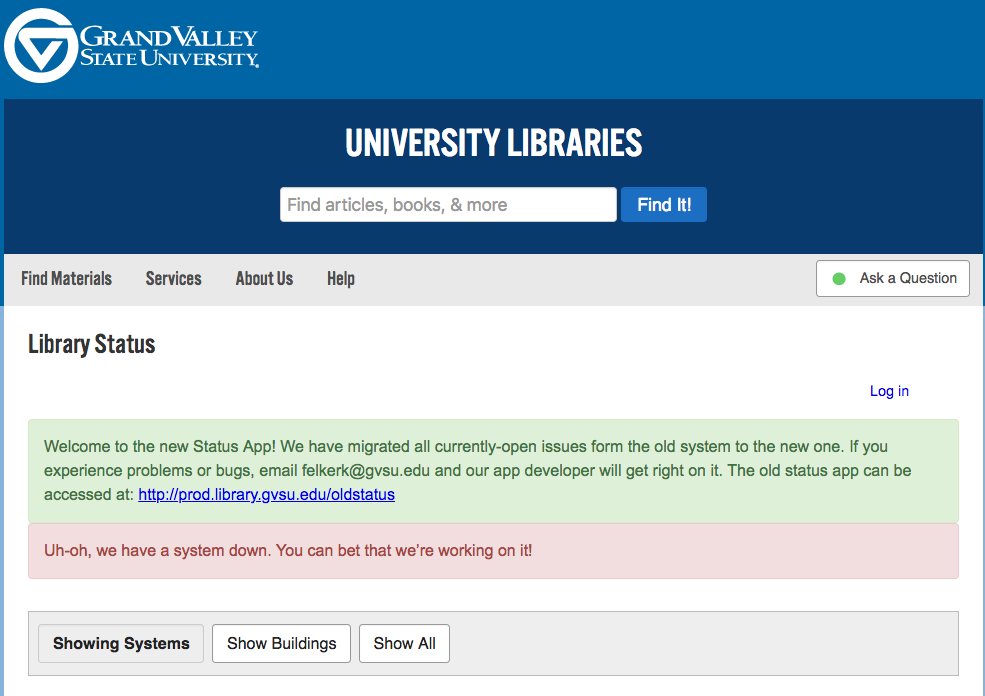
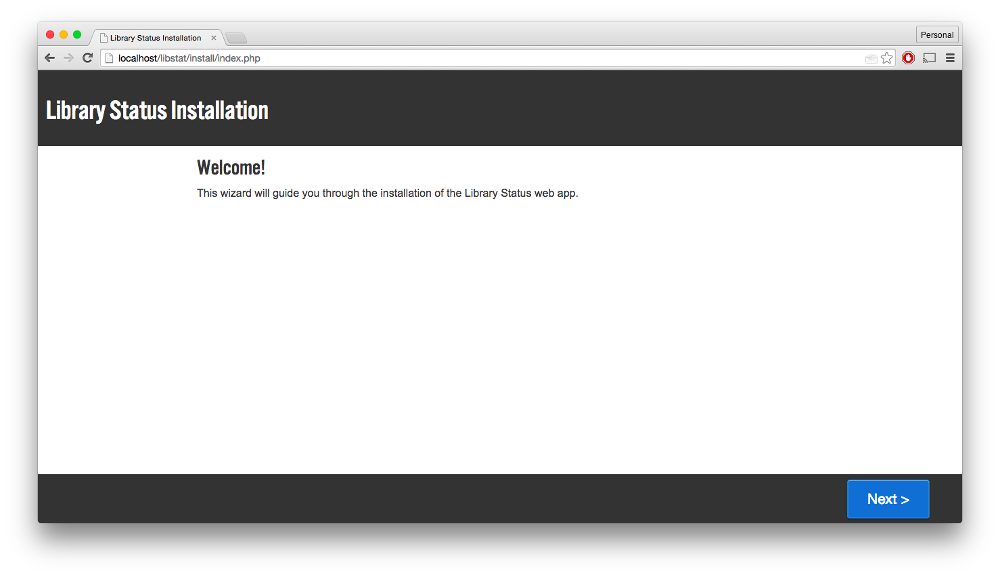

# Library Status

----

Library Status is an online tool for publicly displaying the current status of your library systems.

Libraries rely on a number of different online and other software tools to provide services to our patrons. Often those services go down or have problems for reasons beyond our control, and sharing this information can be difficult. Sending out email blasts for every database maintenance update would quickly have your staff inundated, and doesn't help patrons know when to expect problems. We deicded we needed a centralized place to show the current status of all of our tools so that all of our users, staff and patrons alike, could be informed.

We added the ability to subscribe to updated with RSS or email (using Feedburner), and included the ability to report new problems right from the interface. By making the tool visible on the public web and making it the place to go to report problems, we make sure that everyone has a chance to see the current health of our systems.

You can view GVSU's Library Status app live at [http://gvsu.edu/library/status](http://gvsu.edu/library/status).

### Features

----

* Publicly display the current status of an unlimited number of tools or systems
* Show a detailed record of status updates for each problem
* Easily allow users to subscribe to updates through RSS or Email
* Integrated problem reporting interface that will email new tickets to any email address(es)

### Installation

----

Library Status requires a server running PHP 5.4 or up and MySQL. If you don't have a server like this avalable, a basic hosting package from [Dreamhost](http://dreamhost.com) or something similar would work.

You'll also need a Google account to retreive Recaptcha API keys. You can get those [here](https://www.google.com/recaptcha/admin).

There are two ways to install Library Status: with or without git.

#### Download the files from Github, upload to your server

1. Download the [zip file of Library Status](https://github.com/gvsulib/library-Status/archive/master.zip), and unzip it somewhere on your machine.
2. Now upload all of the files to your server, where you want them to live.
3. In your browser, open up phpMyAdmin or the like, and create a database called status (or whatever you want, but we recommend status).
4. In your browser, navigate to the folder on your server that you uploaded the files. This will begin the installation wizard.
5. If you see the following in your browser, you're in good shape:

6. Follow the instructions in the installation wizard.
7. Once complete, you should be at your main Library Status homepage. Feel free to log in and start using your new Library Status Monitor!

#### With Git/Github

I'm assuming here that you have a server somewhere that not only has PHP and MySQL, but also Git. I also assume you know a bit about ssh, and that you have [Git ssh keys](https://help.github.com/articles/generating-ssh-keys) set up on your server. If that doesn't make sense, you can shoot me an email or maybe try the other installation method.

1. Fork this repo into your GitHub acccount, and clone it on to your server.
2. Navigate to the app in your browser.
3. If you see the following in your browser, you're in good shape:

4. Follow the instructions in the installation wizard.
5. Once complete, you should be at your main Library Status homepage. Feel free to log in and start using your new Library Status Monitor!
### Further Configuration

----

Library Status also provides an interface for sending along problem reports to any email address. By default, names and email addresses are optional. (The form does include a honey pot and some robust naughtiness checking before sending emails, so spam is minimized if not eliminated.) If you want to require email address and/or names when folks submit tickets, you can do so with the following steps:

1. Open resources/php/functions.php in your favorite text editor, and uncomment the relevant line(s) for making the fields required: line 23 for email addresses, line 30 for names.
2. In feedback.php, edit the form fields to have the attribute `required="required"`, which will tell modern browsers to require the field. (This form is your submission form is JavaScript fails or is not enabled by the user.)
3. Open up index.php and look for the small bit of jQuery code at the end of the file (line 586). Here you'll also need to add the `required="required"` attribute.
4. You'll probably want to add some client-side form validation, since form contents are not currently repopulated if they fail server validation. While modern browsers will work well with the `required` attribute, not all browsers support this.
5. Users will have to complete a reCaptcha. Ideally, since we're using the newest API, this will only be a checkbox for them to click. If not, they'll fill out a standard image based captcha and will be able to submit the form.

We'll be making the failed submission recovery more user-friendly in future releases. Feel free to help our if you can!

### Roadmap  

----

Here are features we have planned for future releases. If you'd like to help in developing these features, or would like to suggest other improvements, let us know in the [issue tracker](http://github.com/gvsulib/library-Status/issues).

* The ability to delete a status or update
* Add weekly reminders for open tickets
* Better scheduling of resolutions for those defined maintenance periods (e.g. Lexis Nexis will be offline for maintenance from 12-2am)
* Add help tooltips for each system to better help patrons understand what they are.
* Beef up accessibility with better ARIA support, more clear tabindexes, and better keyboard navigation
* Build a UI for administering users and systems

### Support

----

The authors are happy to help you get Library Status up and running. You can [post a request in the issue tracker](http://github.com/gvsulib/library-Status/issues), or [shoot Matthew an email](mailto:reidsmam@gvsu.edu) or a [tweet](http://twitter.com/mreidsma).

### Contribute

----

We welcome contributions to the library status app. If you are a developer, you can contribute code. If you are not, you can always report bugs through the issue tracker, or help us improve documentation or localization.

* Issue Tracker: [http://github.com/gvsulib/library-Status/issues](http://github.com/gvsulib/library-Status/issues)
* Source Code: [http://github.com/gvsulib/library-Status](http://github.com/gvsulib/library-Status)

### License  

----

This tool is copyright 2014 Grand Valley State University Libraries.

This tool is free software: you can redistribute it and/or modify it under the terms of the GNU General Public License as published by the Free Software Foundation, either version 3 of the License, or (at your option) any later version.

This tool is distributed in the hope that it will be useful, but WITHOUT ANY WARRANTY; without even the implied warranty of MERCHANTABILITY or FITNESS FOR A PARTICULAR PURPOSE. See the GNU General Public License for more details.

You should have received a copy of the GNU General Public License along with this tool. If not, see [http://www.gnu.org/licenses](http://www.gnu.org/licenses/).
